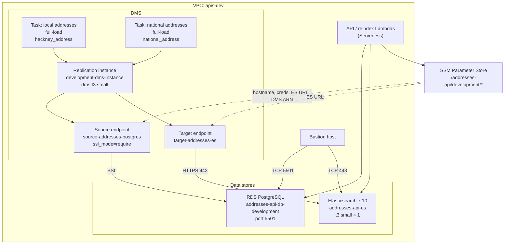
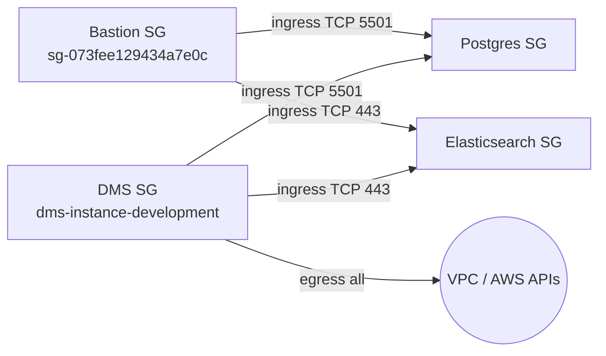
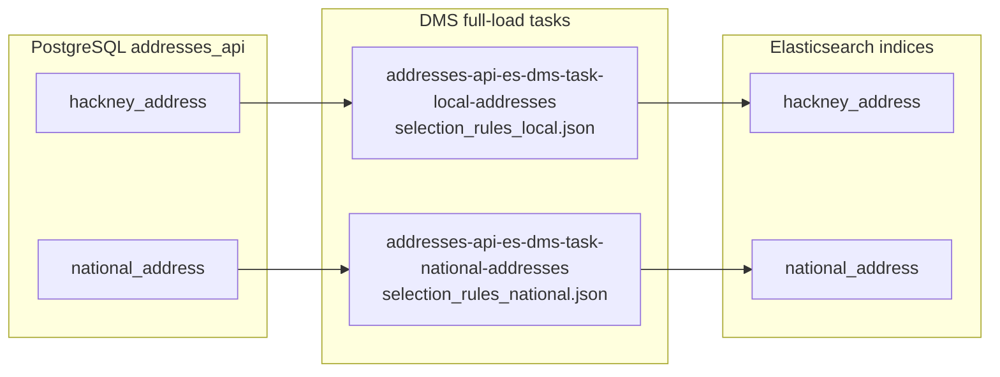
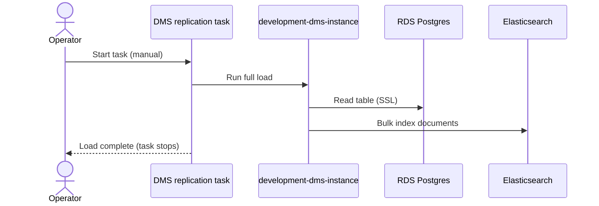

# Addresses API — Development Terraform

This folder manages the **development** data platform for Addresses API: PostgreSQL (RDS), Elasticsearch/OpenSearch, and AWS DMS (full-load replication into Elasticsearch).

State backend: `s3://terraform-state-development-apis/services/addresses-api/state` (`eu-west-2`).

## Architecture



## Network and security groups

Postgres and Elasticsearch use a shared “internal only” security group module (egress only). Extra ingress is attached outside that module so consumers are not forced into the same rules.



| Path | Rule |
|------|------|
| Bastion → Postgres | `aws_security_group_rule.postgres_bastion_ingress` |
| Bastion → Elasticsearch | `aws_security_group_rule.elasticsearch_bastion_ingress` |
| DMS → Postgres | `aws_security_group_rule.postgres_dms_ingress` |
| DMS → Elasticsearch | `aws_security_group_rule.elasticsearch_dms_ingress` |

DMS also needs the account-level IAM role `dms-vpc-role` (`AmazonDMSVPCManagementRole`) so it can place ENIs in the VPC.

## DMS data flow

Both replication tasks are **`full-load` only**. They do **not** run on a schedule — start them manually from the AWS console (or CLI) after connection tests succeed.



1. DMS reads from RDS via `source-addresses-postgres` (**SSL required** — Postgres enforces `rds.force_ssl`).
2. Table mappings transform/select columns (`selection_rules_*.json`).
3. DMS writes into Elasticsearch indices named after the source tables.
4. Nightly **reindex Lambdas** (Serverless) copy those DMS indices into searchable aliased indices. See [docs/elasticsearch_setup.md](../../docs/elasticsearch_setup.md).



## Key resources

| Component | Identifier / notes |
|-----------|-------------------|
| RDS | `addresses-api-db-development`, Postgres 16.13, `db.t4g.small`, port **5501** |
| Elasticsearch | `addresses-api-es`, version **7.10**, `t3.small` × 1, 30 GB EBS |
| DMS instance | `development-dms-instance`, engine **3.6.1**, `dms.t3.small` |
| Source endpoint | `source-addresses-postgres`, `ssl_mode = require` |
| Target endpoint | `target-addresses-es` |
| Tasks | `...-local-addresses`, `...-national-addresses` (`full-load`) |

### SSM parameters

| Name | Purpose |
|------|---------|
| `/addresses-api/development/postgres-hostname` | RDS address |
| `/addresses-api/development/postgres-port` | `5501` |
| `/addresses-api/development/postgres-username` | SecureString (set manually; ignored by Terraform after create) |
| `/addresses-api/development/postgres-password` | SecureString (set manually; ignored by Terraform after create) |
| `/addresses-api/development/elasticsearch-domain` | ES endpoint |
| `/addresses-api/development/dms-rep-instance-arn` | DMS instance ARN (for tasks) |
| `/addresses-api/development/reindexing-queue` | SQS URL for reindex Lambdas (queue created by Serverless) |

## Layout

```
terraform/development/
├── main.tf                          # Root: VPC data, RDS, ES, DMS, SSM
├── task_settings.json               # Shared DMS task settings
├── selection_rules_local.json       # hackney_address mappings
├── selection_rules_national.json    # national_address mappings
└── modules/
    ├── database/postgres/
    ├── database/elasticsearch/
    ├── dms/
    └── security_groups/
        ├── database/internal_only_traffic/
        └── dms/
```

## Premigration assessment (optional)

DMS can run a premigration assessment before starting a task. Reports are stored in a dedicated secure S3 bucket managed in `premigration_assessment.tf` (shared by local and national tasks).

| Resource | Name / SSM |
|----------|------------|
| S3 bucket | `addresses-api-dms-premigration-<account-id>-development` → `/addresses-api/development/dms-premigration-assessment-bucket` |
| IAM role | `addresses-api-dms-premigration-assessment-development` → `/addresses-api/development/dms-premigration-assessment-role-arn` |
| KMS key | `alias/addresses-api-dms-premigration-assessment-development` → `/addresses-api/development/dms-premigration-assessment-kms-key-arn` |

In the console: task → **Actions** → **Create premigration assessment**, then select that bucket, role, and KMS key (`SSE_KMS`).

- Source endpoint must use **`ssl_mode = require`** or Postgres rejects connections with `no pg_hba.conf entry ... no encryption`.
- Credentials in SSM are placeholders at create time; update the SecureString values in the console before testing DMS or the API.
- The reindex SQS queue `sqs-addresses-api-reindex-development` is created by **Serverless** (`serverless.yml`), not Terraform; Terraform only stores the expected queue URL in SSM.
- For broader Elasticsearch / reindex behaviour, see [docs/elasticsearch_setup.md](../../docs/elasticsearch_setup.md).
